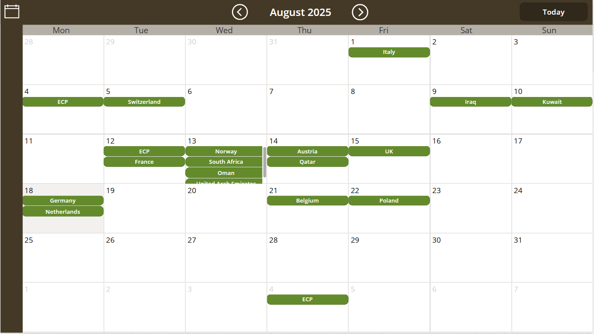
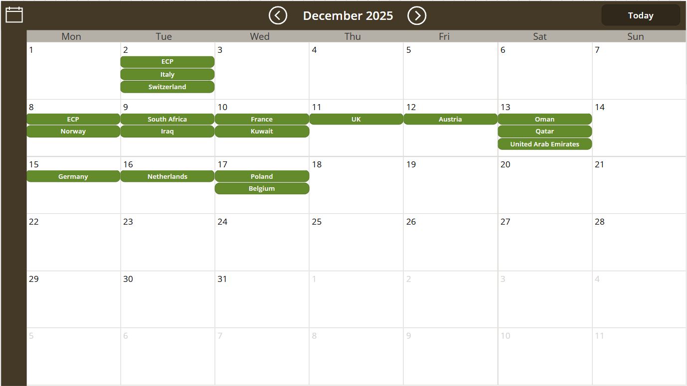

# Payroll Calendar App

## Overview
This app helps HR teams track payroll cut-off dates and avoid missed deadlines.  
It includes a Power Automate flow that sends reminder emails **2 days before the cut-off date**.

##  Features
- Monthly calendar view of payroll cut-off dates  
- Power Automate flow that sends email notifications  
- User-friendly design for HR staff  

## Tools & Technologies
- Power Apps (Canvas App)  
- Power Automate  
- Outlook integration  

## 📷 Screenshots

## How It Works
1. HR uploads the annual payroll cut-off schedule in advance.
2. Any updates to the schedule are reflected in a user-friendly calendar view.
3. A Power Automate flow triggers 2 days before each cut-off date.
4. Email reminders are sent to relevant teams to ensure systems are prepared before payroll closure.

## Impact
- Reduced missed deadlines  
- Improved payroll accuracy  
- Increased team efficiency
