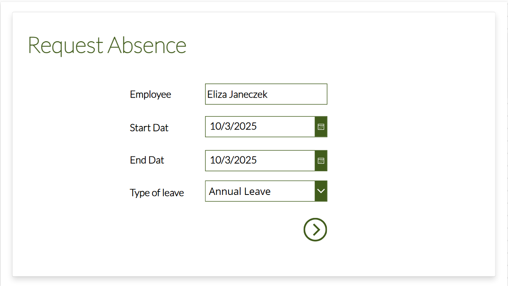
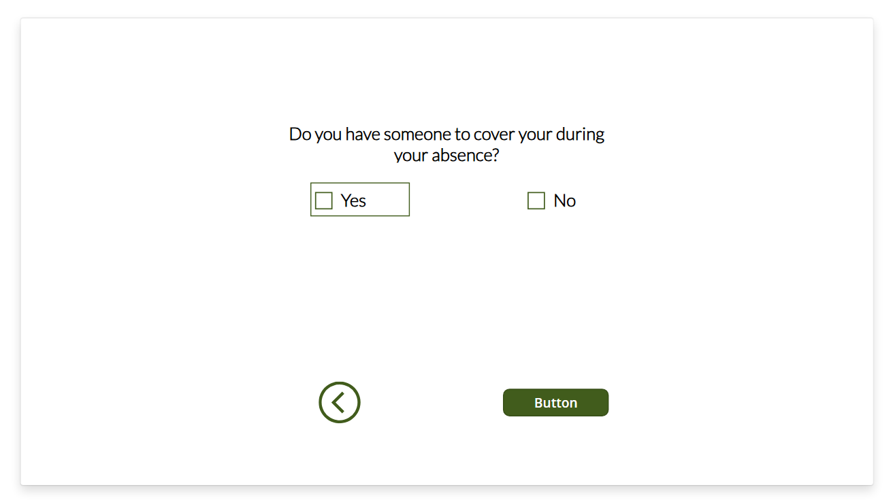

# Request Absence App + Approval

## Overview
This app helps employees request absences and managers approve them through an automated workflow.
It is built with Power Apps, Power Automate, and SharePoint.

Employees submit requests via a Power Apps form, managers approve them in a structured workflow, and approved requests are stored in SharePoint with a calendar view for clear team visibility.

## Features
Employee Request Form (Power Apps)
- Select leave type (Annual, Sick, Parental, etc.)
- Choose start and end dates (with validation)
- Indicate coverage and select a buddy if arranged
  
Approval Workflow (Power Automate)
-Sends request to the employee’s manager
-Manager can approve or reject with comments
-Automatic updates in SharePoint

Calendar View (SharePoint)
-Approved absences displayed in a monthly calendar
-Easy visibility of team availability

## Tools & Technologies
-Power Apps (Canvas App)
-Power Automate
-SharePoint Online

## Screenshots

## How It Works
Employee submits an absence request in Power Apps.
Power Automate flow routes the request to the manager.
Manager approves or rejects the request.
Approved requests are saved to SharePoint.
Calendar view shows all approved absences for team planning.

## Impact
Centralized leave management in one place
Reduced manual tracking and back-and-forth emails

Improved transparency of team availability

Increased efficiency for employees and managers

Increased efficiency and team visibility
